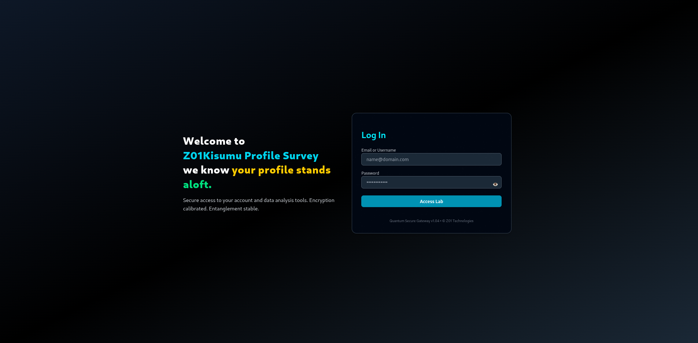
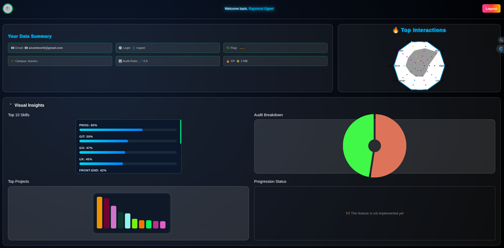

# 📊 GRAPHQL

*The graphql is a JavaScript project that analyzes XP transactions and displays the data using interactive charts.*

## Features

|Login Page|Profile Page|
:-:|:-:
|

- *Interaction with user (Groups + Audit).*

- *Display the ratio using a pie chart.*

- *Display the top 10 big projects.*

- *Simple and intuitive interface.*

## Installation

1. Clone the repository:

```bash
git clone https://github.com/anxielray/graphql.git
```

2. Navigate to the project directory:

```bash
cd graphql
```

3. Open the `index.html` file in your web browser.
